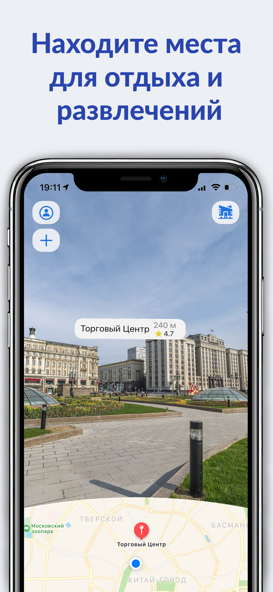
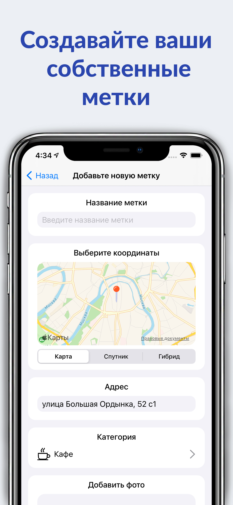
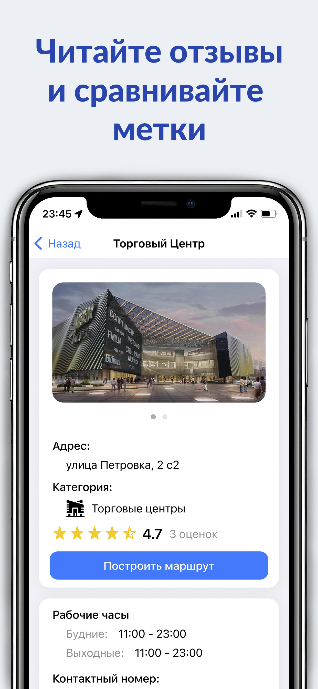
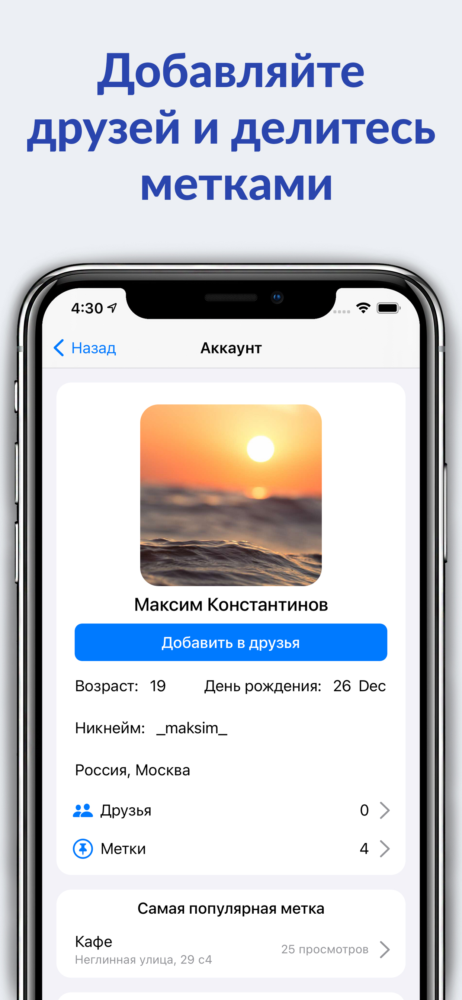
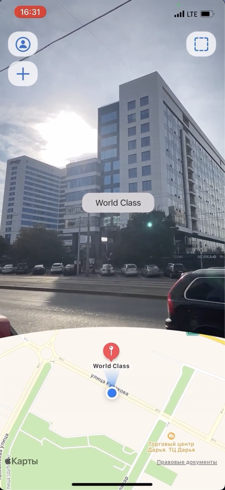
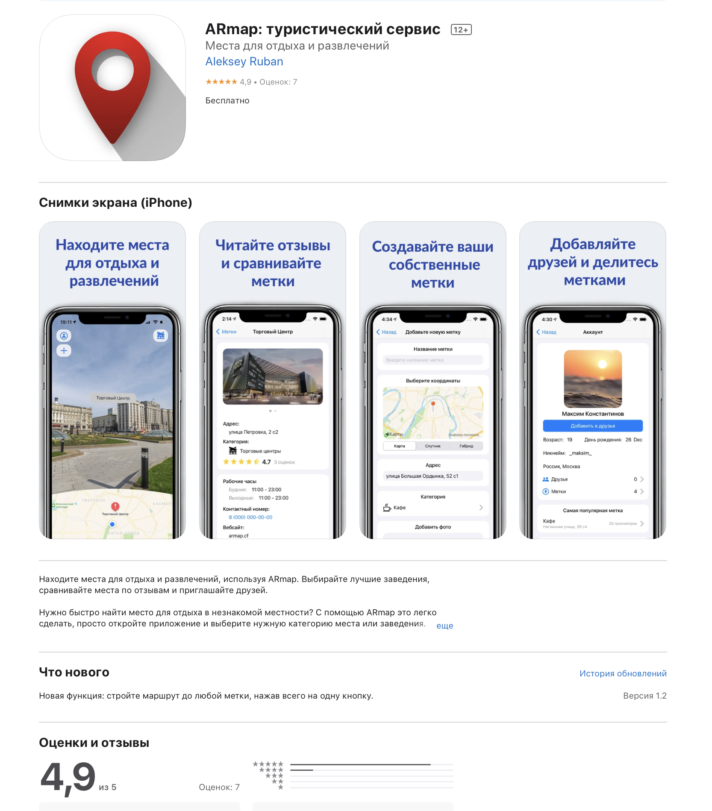

# ARmap – Туристическое приложение с дополненной реальностью

**ARmap** – это туристическое приложение, которое позволяет ориентироваться в городе с использованием технологии дополненной реальности (AR). 

## Основные функции приложения:
- **Ориентация в городе с AR**: Пользователи могут видеть важные объекты и ориентиры в дополненной реальности.
- **Добавление меток на карту**: Каждый пользователь может создавать собственные метки, которые затем отображаются в AR.
- **Социальные функции**:
  - Создание аккаунта для управления своими метками.
  - Добавление друзей.
  - Обмен метками с друзьями для совместного использования.

  
  

  
  

## Техническая реализация:
- **Клиент-серверное взаимодействие**: Обмен данными между клиентом и сервером для синхронизации меток и пользовательских данных.
- **Многопоточность**: Оптимизация работы приложения с использованием потоков для повышения производительности.
- **Архитектурный подход**: Реализовано с использованием паттерна **MVC**.

## Интерфейс пользователя (UI):
- Разработан с использованием **UIKit**, включая:
  - **Storyboard** для визуального проектирования интерфейса.
  - **AutoLayout** для адаптивной верстки.
  - Программная генерация UI-элементов в коде. 

## Видео-демонстрация приложения:
Смотреть [видео на YouTube](https://www.youtube.com/watch?v=rcMmFjktuFk)

## Дополнительные возможности:
- **Push-уведомления**: Реализована поддержка уведомлений с использованием **APNS (Apple Push Notification Service)**.

## История и достижения:
- В 2021 году приложение было опубликовано в **AppStore** и стало доступно для пользователей.

ARmap сочетает в себе удобство ориентирования, функциональность социальных сетей и современные технологии дополненной реальности, делая путешествия более увлекательными и комфортными.
